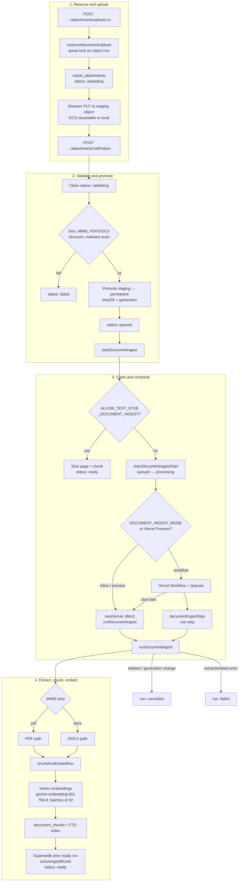
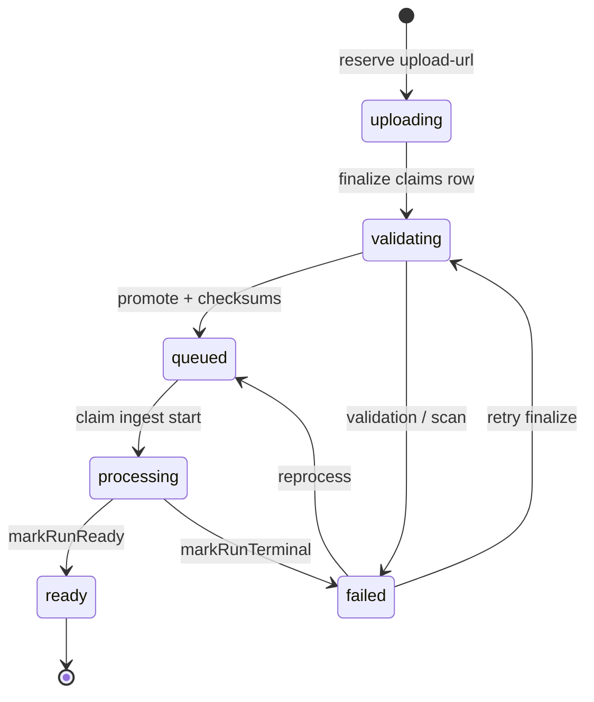
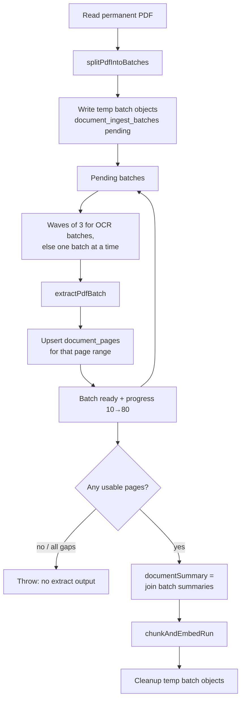
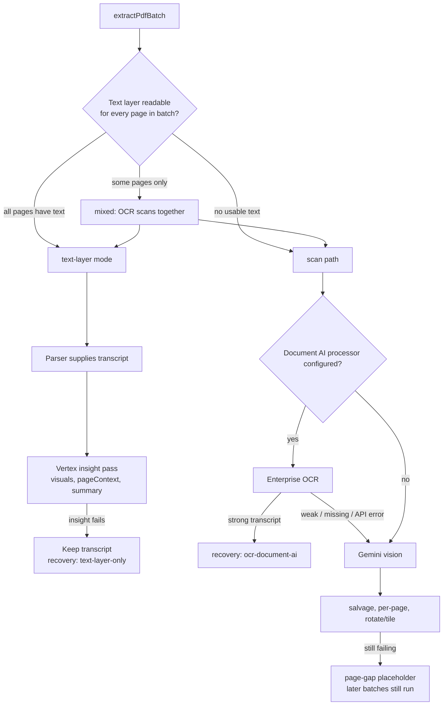
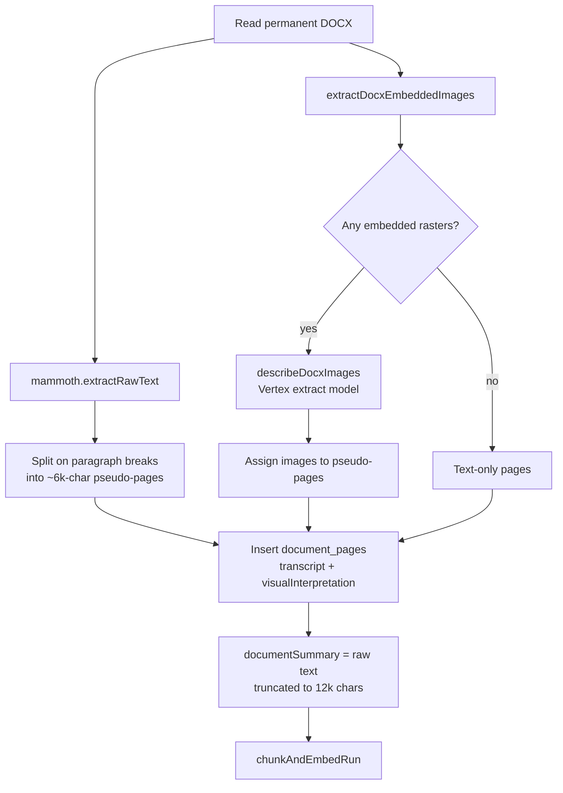
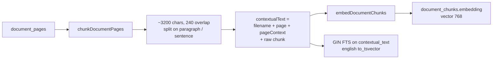
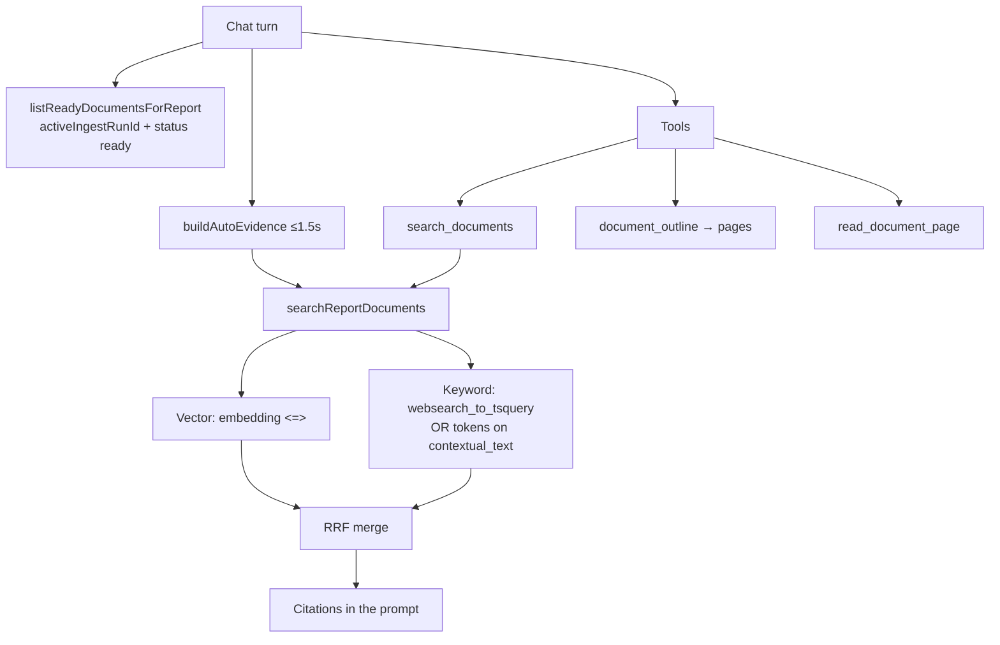

# Document ingest pipeline

How PDF/DOCX attachments become searchable evidence for report chat. Extract and embed are **Vertex-only** (`GOOGLE_VERTEX_PROJECT`). A Vercel AI Gateway key is not enough. Local/E2E stub: `ALLOW_TEST_STUB_DOCUMENT_INGEST`.

Entry points: `startDocumentIngest` → `runDocumentIngest`. Chat later reads `document_pages` / `document_chunks` via hybrid retrieval.

## Attachment status

Ingest **run** statuses (separate table): `pending` → `running` → `ready` | `failed` | `cancelled`. A new successful run marks the previous `ready` run `superseded`.

## PDF path

Born-digital PDFs stay on ~3-page sequential batches (max 5, or smaller if the slice exceeds ~18 MB) so Gemini can add visual context with carry-forward notes.

Scans and mixed PDFs with Document AI configured split into **15-page** batches (or smaller if a slice exceeds 40 MB). Ingest processes up to **3 of those batches in parallel**. Gemini vision still runs only on weak OCR pages, one page at a time. Previous batch `batchSummary` / `continuationNote` are passed forward on the sequential (born-digital) path only.

### Extract modes and recovery

Born-digital pages use the PDF text layer as the transcript. Scans go through Document AI Enterprise OCR when `DOCUMENT_AI_PROCESSOR_ID` is set; weak or failed OCR pages fall back to Gemini vision (rotate/tiles). Mixed PDFs OCR the scan pages in one request and keep the text layer for born-digital pages.

Extract model: `gemini-3.1-flash-lite` at Vertex location `global` (`DOCUMENT_EXTRACT_LOCATION`). OCR uses a **regional** Document AI processor (`DOCUMENT_AI_LOCATION=us` or `eu` — never `global`). Embeddings stay on `GOOGLE_VERTEX_LOCATION` (often `us-central1`). Those locations must not be conflated. Prompt version: `doc-extract-v4`.

## DOCX path

No real page model. Mammoth extracts body text; OOXML rasters are described with the same Vertex extract model as PDF vision.

## Chunk and embed

Shared by both kinds. Transcript and visual interpretation are chunked separately (`quote` vs `visual_interpretation`).

## What chat reads

The report body is **not** in `document_chunks`. Ready attachments are listed in the chat context map (filename + sanitized `documentSummary`). Each turn may also run fail-soft kickoff retrieval.

## Tables

| Table | Role |
| --- | --- |
| `report_attachments` | File row, `processing_status`, `active_ingest_run_id`, generation |
| `attachment_ingest_runs` | One extract/embed attempt; `document_summary` |
| `document_ingest_batches` | PDF page slices + temp object keys (PDF only) |
| `document_pages` | Transcript, visual interpretation, `page_context` |
| `document_chunks` | Searchable spans + 768-d embedding |

## Safety rails

- `gcsGeneration` is pinned at start. Delete or replace mid-run → `cancelled`.
- Concurrent finalize/start is serialized with `FOR UPDATE` on the attachment (and on the report for quota).
- Workflow `start()` failure falls back to inline `after()` so uploads do not stick on queued.
- Stale `processing` rows can be reclaimed, then `POST .../reprocess` re-queues.
- Untrusted model text (`documentSummary`, `pageContext`) is sanitized in chat/tools, not in the attachments package.
