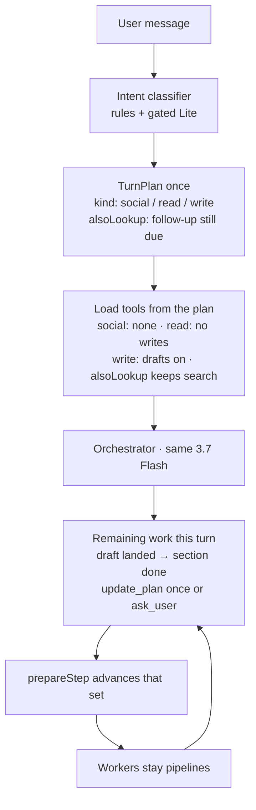
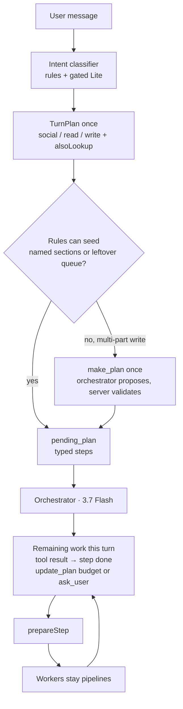

# Chat harness plan (from the `dev 6` session)

Living plan for the **agent harness**: what we resend per step, which
heuristics decide tool availability, and how retrieval ranks pages.
Retrieval-internal phases (ingest → chunk → rank) stay in
[`retrieval.md`](retrieval.md); this file is the layer above it.

The rule for this plan: **subtract first**. The harness grew one guard,
one regex, and one prompt paragraph per incident. Most items below remove
code. Every item that adds code names what it retires.

## Status (this branch)

Successive commits on `cursor/retrieval-harness-improvement-plan-46ff`.
Live report creation on the PR is still the layer-3 merge gate.

| Item | Status |
|---|---|
| Characterization + TurnPlan + step policy (B2/B3 extract, F1 layer 1) | Landed. Seven gates run inside `prepareReportChatStep`; classifiers assemble into `ChatTurnPlan`. `harness-scenarios.ts` locks greeting / rewrite / placeholder fill / empty inventory / identifier lookup. |
| B1 `commit` edit-policy deletion | Landed. |
| A1 in-turn compaction | Landed. |
| A2 tool-result budget | Landed (`toolResultBudget`). |
| A3 Vertex implicit-cache check | Not a code change. Confirm cached input tokens on the PR's Langfuse traces; if the prefix is unused, a stable per-turn tool set is still open work. |
| A4 prompt diet | Landed (`CHAT_PROMPT_VERSION` `chat-v107-harness-diet`). Independently revertible. |
| A5 tool-schema diet | Landed. |
| C1–C3 placeholder fill | Landed (`placeholder_fill`, not a page walk). |
| C4 same-turn unsupported-facts repair | Landed. Write tools search once and re-ground; no LLM subagent. |
| D1–D3 ranking | Landed (slash IDs, local IDF, per-file diversity). |
| E1–E3 honest finish / list_attachments / continue budget | Landed. |
| B4 retire heuristics D2 covers | **Evaluated, not deleted.** IDF + diversity cover the cover-magnet ranking case. Divider regexes (`attachment-divider.ts`) mark locators for `keepSearchOpen` — that is not ranking. Analytics `requirementIndex` TOC demotion and ELR inventory column needles score a different question than token rarity. No new heuristic. |
| B5 one page-objective scorer | Landed as one haystack (`pageObjectiveHaystack`) shared by inventory scoring and `scoreReviewPage`. `routeSearchTargets` stays file/span routing for identifier queries. |
| F2 MJ overlay replay / F1 live LLM cost | Live Gemini Agent turns are still not a CI job. The **deterministic quality floor** is: `scripts/eval/chat-draft-cases.json` + `pnpm chat-eval -- --replay` (also Vitest) and report-shaped `scripts/eval/report-eval-cases.json` + `pnpm report-eval -- --replay` (`--capture` / `--search --report-id` on a laptop). Optional Langfuse datasets `chat-draft-quality-floor` and `report-quality-scenarios` (`--sync` / `--experiment`) compare runs in the UI. Write-path `edit_table` incidents still use `qsr-rtm-draft-replay.test.ts`. Playwright stub chat cannot assert tools. |
| Live QMS vs calibration-planner walk | Landed. ELR inventory start no longer page-lists files typed as a different inventory (a calibration planner is not QMS). Page scoring ignores running-header `document no`. The planning chip names queued files, not the whole vault. |
| Remaining-sections UI (plan slot, false error, done popup, idle Working… / N of N chip) | Landed. Plan progress sits below the transcript. Auto-continue rows stay hidden and do not resurrect the original user bubble. Successful section turns do not toast “hit an error”. Agent-done notice is `Assistant is done with {section}`. Working… hides when the stream is idle (stale optimistic send overlay after hydrate). The N of N chip spins only while the turn is running, shows Paused on Cancel, and hides when every remaining section is drafted. |
| Remaining-sections seed miss (`dev 7` “go on to monitoring and sections after that”) | Landed. That phrasing is a write (`go on`) but was not a multi-section seed, so the first leftover-inventory turn had no queue and milled reviews until the 270s abort. Queue still does not cap start/finish loops inside one inventory turn — that abort cluster remains after an explicit `draft remaining sections`. |
| General-purpose planner | **Stage 1 landed (§2c).** Gated `make_plan` (`task-plan.ts`) writes section steps into the existing `pending_plan` queue and lookup steps into the in-turn ledger; completions stay mechanical. Table / review / Analytics steps, extended `update_plan`, and Plan-mode approval are later. |

## 1. What `dev 6` actually cost (measured, not estimated)

Langfuse v2 metrics, observations filtered on `metadata.documentNo = "dev 6"`:

| Leaf generation | Calls | Input tokens | Output tokens | Cost |
|---|---|---|---|---|
| `report-chat` orchestrator steps | 319 | 53,208,074 | 111,012 | **$20.93** |
| Document-review page extracts | 53 | 84,436 | 17,494 | $0.07 |
| Criteria eval | 26 | 50,584 | 4,551 | $0.02 |
| Suggestions | 7 | 40,349 | 12,557 | $0.23 |
| Draft entailment | 64 | 35,583 | 2,974 | $0.02 |

By model the session is $22.83, of which the `report-chat:ai.streamText`
parent spans are $1.45 of double-counted rollup — call it **~$21.4 of real
spend, and the orchestrator is $20.93 of it**.

Three numbers drive everything below:

1. **Input : output is 479 : 1.** The model barely writes. It *reads*.
2. **167k input tokens on the average step**, 35 turns / 319 steps
   (9.1 steps per turn). The worst turn ran 20 steps at **475k input
   tokens per step** and cost **$3.10 by itself**.
3. Per-step input is roughly `system prompt + tool schemas + every tool
   result so far this turn`. Only the first two are bounded today.

So the harness is not expensive because it thinks too hard. It is
expensive because **every step resends the whole turn**, and because bad
retrieval adds steps that each resend more. Ranking work matters mostly
through step count.

## 2. What the harness weighs today (measured)

| Thing | Size |
|---|---|
| `src/lib/ai/chat/*.ts` (non-test) | 16,998 lines |
| `src/lib/ai/chat/*.test.ts` | ~15,000 lines |
| `tools.ts` | 3,752 lines, 14 tools |
| Tool `description` + `.describe()` text | ~14.6 KB ≈ **3.7k tokens every step** |
| `system-prompt.ts` template literals | ~43.6 KB ≈ **up to 10.9k tokens** before A4 (`CHAT_PROMPT_VERSION` is now `chat-v107-harness-diet`) |
| Turn classifiers | `user-intent.ts` (387 lines, 55 regexes), `retrieval-policy.ts` (252 lines, 30 regexes), `resolve-user-intent.ts`, `already-drafted.ts`, `section-intent.ts` |
| Page/objective scorers | `review-page-plan.ts`, `inventory-review-schema.ts`, `attachment-divider.ts`, `retrieval-route.ts`, `retrieval-query.ts` |
| `prepareStep` gates in the report chat route | **7** independent gates mutating `activeTools` |

The seven gates are `userIntent` → `tableEditLoopDirective` →
`alreadyDraftedReadStep` → `tableSchemaReadStep` →
`prepareDocumentReviewStep` → `searchLoopDirective` →
`documentAskUserDirective`, then `withoutDraftFieldTools`. They are
written independently, run in a fixed order, and each one answers a
slightly different version of the same question: *which tools may the
model call on this step?*

There are effectively **two control planes** saying the same thing: server
heuristics that hide tools, and prompt copy that asks the model not to use
them. Every incident has added one of each, plus a test.

## 2b. Control plane — keep the intent classifier

The kickoff **intent classifier stays in front of the orchestrator**. Do
not fold "hi" vs "draft Purpose" into Gemini 3.7 Flash: that model is
~$21 of a ~$21.40 session, and write tools must already be hidden before
it runs. The orchestrator **consumes** a `TurnPlan` and **advances
remaining work** mid-turn (write this section, then answer the follow-up).
It is not a second greeting classifier. Remaining-work (`remaining-work.ts`)
has landed: mixed `alsoLookup`, mechanical draft completions, one-shot
`update_plan` / `ask_user`.

A mixed turn is still **one** coarse `kind` (write tools stay loaded if
any write was asked) plus `alsoLookup` when they also asked a follow-up
("draft Purpose, and what is the batch number?"). Dropping the follow-up
because a draft landed is the failure mode. Re-classifying "hi" on every
`prepareStep` is not. Remaining work is a ledger `prepareStep` mutates
from tool results, not a todo the orchestrator rewrites every step:
completions are mechanical, `update_plan` is one-shot (skip queued N/A or
add empty `draftOrder`), and unsure skip/add goes to `ask_user`. Lookups
do not grow from retrieval. Cited-hit search stays open only while the
write is still due; two empty greps always hide. `pending_plan` is still
the persisted remaining-section queue across turns — remaining-work does
not replace it. A general-purpose planner (§2c) widens that queue; it
does not replace the kickoff classifier or the in-turn ledger.

## 2c. General-purpose planner (stage 1 landed)

**What landed (stage 1).** `src/lib/ai/chat/task-plan.ts` plus the
`make_plan` chat tool. The orchestrator may call it once on an Agent
write turn when `makePlanEligible` holds: `canEdit`, no live unpaused
queue, not an auto-continue POST, and the ask looks multi-part
(`alsoLookup`, two or more named sections, or a long request with at
least two clause breaks). Steps are `section` (editable section key) or
`lookup` (a question). The server takes 2–8 steps, at least one section,
no duplicates, and rejects the call if a plan is already live. Section
steps persist as the usual `pending_plan` section queue
(`source: "make_plan"`, recap/conclusion moved last, other order
preserved, first step `in_progress`), so the progress chip and
auto-continue work unchanged. "Draft the report" does not call
`make_plan`: the context map already lists sections and ready files, and
`seedSectionQueuePlan` queues the empty `draftOrder` with conclusion
last (`plan-execution.ts`). Same-turn siblings are QSR RTM (and adjacent
non-inventory prose). A terminal conclusion never pairs, and write tools
return `recap_not_ready` while earlier empty bodies remain. Page extracts stay the worker pool inside one review. There is no
second model and no LangGraph runtime. LangGraph would host this
decision later; it would not fix intent or grounding. The decision
(`single`, `queue`, or `require_model_plan`) is stamped on the Langfuse
trace as `executionPlan` so a bad plan is visible. Independent siblings
share a turn, up to three. A separate drafting model per section waits
until that worker can see the same citation ledger — splitting the model
first would make accuracy worse. Lookup steps are
in-turn ledger items only (`lookup:plan:N`); they keep search open while
a write is still due and are not persisted. Budget: one success, two
attempts, and the tool is hidden after `ask_user` or once any document
write lands. A draft landing still marks its step done;
`advancePlanAfterTurn({ createdThisTurn })` credits every plan section
drafted on the planning turn and does not pause a planning-only turn
as `no_progress`. Not on the Plan-mode allowlist; Analytics has no
`make_plan`. `update_plan` is unchanged (it only loads once a queue is
live). Harness cases: `harness-multi-part-offers-make-plan` and
`harness-sentence-rewrite-no-make-plan` in
`scripts/eval/chat-draft-cases.json`.

The design below is the full target; the parts not listed above (table,
review, and Analytics steps; extended `update_plan`; Plan-mode approval)
are still to do.

We already have most of a planner, just a narrow one. `pending_plan` is
a saved plan that carries across turns, but it can only be
`kind: "section_queue"`: sections with queued / in_progress / done /
skipped. Rules build it without a model call — "draft 5.2, 5.3, 5.4"
becomes those empty named sections; "draft the remaining sections"
becomes the empty `draftOrder`. Within a turn, remaining-work tracks
progress: drafts complete their section automatically, and `update_plan`
can skip or add a section once. Multi-step sections are hardcoded per
type (MJ ELR evidence: review → table → assessment with a count), not
plan steps.

The missing pieces are plans that are not just sections, a model-written
plan when rules cannot build one, and steps inside a complex section.

Two limits keep this from turning into tool-call hell:

1. **The orchestrator proposes the plan. The server decides what counts
   as a step and when a step is done.**
2. **Plan edits have a small, fixed budget per turn.**

### Shape

Widen `pending_plan`, do not add a second architecture. Allow typed
steps: a section, a table in a section, a lookup, a document review, or
an Analytics action. Each step names what finishes it (draft landed,
table filled, cited answer, review finished). JSON column — no migration.
Today's section queues read as plans made only of section steps.
`remaining-work.ts` stays the in-turn ledger; `pending_plan` stays the
persisted queue.

### Rules first, then `make_plan`

"Draft 1, 2, 3", "draft the report", and "draft the remaining sections"
must not spend a Gemini call — `seedNamedSectionQueuePlan` /
`seedSectionQueuePlan` already get them right from the section list. The orchestrator writes a plan only when rules
cannot: mixed write+lookup+table ("draft Purpose, fix table 3's dates,
and which batches failed"), or one section with real sub-steps.

`make_plan` loads only in Agent, on a write turn, when kickoff flags the
ask as multi-part. One call per turn. The server rejects steps that name
unknown sections, an unknown completion rule, or more than a small
maximum. Greetings, simple questions, and single-section rewrites never
see it. Off the Plan-mode allowlist until stage 2. Analytics has no
`make_plan` in stage 1 (typed Analytics steps can wait).

### Mid-turn updates

Keep `update_plan` with the same budget: one successful change, two
attempts, hidden after any `ask_user`. It may add, skip, split, or
reorder. It may never mark a step done — only a matching tool result
can. Unsure skip/add still goes to `ask_user`. Lookups stay
kickoff-seeded (`alsoLookup`); they do not grow from retrieval.

### Surfaces

Show the proposed steps in Plan mode for the engineer to approve or
edit. Run them in Agent mode through the existing progress chip and
auto-continue. Stage 1 (landed) is `make_plan` with section and lookup
steps + step-policy / harness cases. Extended `update_plan` and typed
table / review / Analytics steps follow. Stage 2 is the Plan-mode approval
screen (separate UI). Prompt copy changes bump `CHAT_PROMPT_VERSION`
(and Analytics only if that surface gains the tool).

### Eval

Report-eval cases should score: whether the plan covered the ask, how
many edits it took, how many turns until done, and whether any step
closed without evidence. An LLM judge is reserved for "was this plan
sensible for the ask"; coverage, edit count, and unearned completions
are deterministic. Stage 1 ships the replay cases that check whether
`make_plan` is offered; the plan-quality scores come with stage 2.

### Risks

- **Cost.** The orchestrator is ~$21 of a ~$21.40 session. Rules first
  and a gated tool are the bound.
- **Plan churn.** Without the edit budget and automatic completions, the
  model revises the plan instead of doing the work.
- **Plans that sound finished but are not.** A step marked done without
  evidence is worse than no plan.
- **Hardcoded ELR completion.** Typed steps should absorb
  review-then-assessment rather than growing another per-type special
  case — name that retirement when the code lands.

## 3. Design rules for this plan

1. **Net-negative lines.** Target `src/lib/ai/chat` non-test under
   **14,000 lines** (from 16,998) when this plan is done.
2. **One control plane per decision.** If the server can enforce it, the
   prompt does not repeat it. `intentToolAvailabilityRule` already tells
   the model generically which tools are absent — that is the pattern.
3. **No new heuristic without a retirement and a case.** A new regex or
   scorer must (a) name the rule it replaces and (b) ship with an eval
   case that fails before and passes after. If the case does not move,
   the heuristic does not merge.
4. **Cost is a test result.** Tokens-per-step and steps-per-turn are
   regression metrics, not vibes (§9).
5. **Bounded payloads beat clever prompts.** A tool result that cannot
   exceed N tokens removes the need for prose telling the model to ignore
   most of it.
6. **Quality is a floor, cost is a ceiling.** A cheaper turn that cites
   the wrong page, leaves more placeholders, or returns more
   `unsupported_facts` is a fail. §13 is the merge gate; §11 is not
   enough.

## 4. Workstream A — Context diet (the biggest lever; mostly subtraction)

Goal: cut median input tokens per step from **167k to under 60k** without
losing any grounded fact.

- **A1. Compact the *current* turn, not just past turns.**
  `compactChatToolHistoryForModel` only shrinks persisted history before
  `convertToModelMessages`. Within a turn, step 12 still resends the raw
  results of steps 1–11. AI SDK 6.0.182 `prepareStep` can return
  `messages`, and the SDK ships `pruneMessages`. Apply the same digest
  rules in-turn: a `search_documents` result older than two steps becomes
  its citation list; a consumed `read_document_page` becomes the quoted
  span the draft used; `finish_document_review` becomes its
  `citationDigest`. This is the single change most likely to halve the
  session cost.
- **A2. Budget every tool result.** Cap the bytes each tool may return
  (`search_documents` 16 hits × ~900-char excerpts, `read_section` labeled
  R#/C# grid, `read_document_page` full transcript, `finish_document_review`
  findings). One shared `toolResultBudget` helper, applied at the tool
  boundary, replaces per-tool ad-hoc slicing.
- **A3. Stop rewriting the tool block every step.** Seven gates mutate
  `activeTools` step to step. Besides being hard to reason about, a
  changing tool block changes the request prefix, which is the part a
  provider-side implicit cache can reuse. **Verify first** whether Vertex
  reports cached input tokens for these calls; if the prefix is not being
  reused, a stable per-turn tool set is worth more than any ranking tweak
  at 167k tokens/step. Prefer *one* decision at turn start plus a small
  number of phase transitions.
- **A4. Prompt diet.** Measure the assembled prompt per pack/document
  type (it is conditional; 10.9k tokens is the ceiling, not the mean),
  then delete every block that restates a server-enforced guard or a
  fixed incident. Target −40% assembled tokens. Bump
  `CHAT_PROMPT_VERSION` once for the whole diet, not per block.
- **A5. Tool-schema diet.** ~3.7k tokens of description text rides along
  every step. Descriptions should say what a tool does and what it
  returns; they should not carry retrieval policy, loop advice, or
  incident history (`SEARCH_COVERAGE_HINT` is seven sentences of loop
  policy attached to every search result).

## 5. Workstream B — Delete dead and duplicated harness

- **B1. The `commit` edit policy is dead code.** `deriveChatEditPolicy`
  unconditionally returns `"propose"` (it `void`s both arguments). Yet
  `commit-edit.ts` (173 lines), the `ChatEditPolicy` union, and
  `editPolicy === "commit"` branches in `tools.ts`, `system-prompt.ts`,
  and `charts/plot-measurements.ts` all still exist, plus their tests and
  prompt copy. Delete the union, the module, the branches, the copy.
- **B2. One step policy, not seven gates.** Replace the gate chain with a
  single `chatStepPolicy({ phase, intent, steps })` returning
  `{ activeTools, toolChoice }`, with a table of transitions and one
  colocated test file. The existing rules become rows, not modules. This
  is where `search-loop.ts`, `table-schema.ts`, `already-drafted.ts`, and
  `prepareDocumentReviewStep`'s tool-hiding half converge.
- **B3. One turn plan, not five classifiers.** `classifyChatUserIntent`,
  `classifyRetrievalPolicy`, `resolveChatUserIntent`,
  `detectSectionIntentFromText`, and the pushback/keep-going regexes all
  read the same user turn with overlapping patterns (85 regexes between
  the first two). Compute a single `TurnPlan` once per request —
  `{ intent, alsoLookup, retrievalPolicy, scope, reviewObjective }` — and
  let everything downstream consume it. Delete the per-consumer
  re-derivation. The orchestrator may **refine remaining work** as tools
  return (draft landed → still search for the follow-up); it must not
  replace the kickoff classifier. Gated `make_plan` (§2c, stage 1 landed)
  consumes this `TurnPlan`; it does not re-classify greetings.
- **B4. Retire heuristics the eval cannot defend.** Candidates:
  APS/calibration-specific divider regexes in `attachment-divider.ts`,
  `requirementIndex` TOC demotion, the needle tables in
  `inventory-review-schema.ts`. For each: write the case first. If a
  rarity-based score (D2) covers it, delete the special case.
- **B5. Dedupe page-objective scoring.** `review-page-plan.scoreReviewPage`,
  `inventory-review-schema.scoreInventoryReviewPage`, and
  `retrieval-route.routeSearchTargets` each answer "does this page match
  this objective" with different signals. One scorer, three callers.

## 6. Workstream C — Placeholder fill as a first-class path

This is the cost bug the session kept hitting: a table with rows and
`<date>` / `<identifier>` placeholders is a **closed set of lookups**, but
the harness escalated it to `start_document_review` and walked hundreds of
pages. Net effect of this workstream is a deletion: the escalation branch
for partially-filled tables goes away.

- **C1. Targeted fill retrieval.** Build queries deterministically from
  the placeholder scan we already run (`src/lib/placeholders`): row key
  cells + column header + section context, one query per placeholder,
  batched through the existing `searchReportDocumentsMany`. No LLM in the
  query builder.
- **C2. A partial table never forces a page walk.**
  `inScopeEmptyInventoryNeedsReview` must stay strictly about *empty*
  inventories. Placeholders in a populated table route to C1.
- **C3. Ground the fill.** Pages retrieved by C1 seed the
  `CitationPageLedger` in the same turn, so the `block` policy has real
  quotes and stops returning `unsupported_facts` on facts that are in the
  PDFs.
- **C4. Repair on the write, not a later fill turn.** Round-1 drafts
  still dump `<date>` / `<identifier>` after a document review of the
  wrong page (planner vs certificate). Prompt-only "if unsupported_facts,
  search then fill" does not run under the 270s abort. On a blocked
  write, `draft_field` / `edit_table` / `propose_edit` run the same
  closed-set search as C1 once, seed new quotes, and re-ground the
  *original* text. New pages keep the write from persisting; the tool
  result includes the snippets so the next step can fill. Leftovers after
  a page that already had a quote still persist (true miss). Not a
  Flash-Lite subagent.
- **Done when:** a "fill the placeholders in tables 9–11" turn completes
  in **≤4 steps** with no `start_document_review`, and the cited pages
  match the pages a human would open. Round-1 inventory drafts do not
  persist `<cal due date>` when a certificate page is searchable.

## 7. Workstream D — Ranking (small code, gated by cases)

Ranking is not the main cost lever, but wrong hits buy extra steps, and
every extra step costs a full context resend.

- **D1. MJ document numbers are identifiers.** `requirementIds()` only
  matches dash forms (`SW-LWB-4`); MJ's `PMC/PR/014`, `SOP/DP/QA/014` fall
  through to semantic search and rank against every cover page. Add the
  slash form at **query time first** so ready files do not need
  re-ingest; only bump `PARSER_VERSION` if the page-column path proves
  necessary.
- **D2. Rarity beats special cases.** `lexicalMatchScore` weights every
  token equally, so "equipment", "system", and "report" pull cover pages
  to the top. Add a per-report document-frequency damp. If it works, it
  retires hand-written cover/header demotions (B4).
- **D3. Per-file diversity cap.** At most two hits per file in the top
  `limit` unless the query is a file locator, so one 273-page attachment
  cannot occupy all eight slots.

Each lands with its own case in `scripts/eval/retrieval-cases.json` (or
the private overlay for MJ-shaped documents). Non-goals from
`retrieval.md` stay locked: no cross-encoder, no cap raises, no
force-reindex.

## 8. Workstream E — Honest coverage, fewer dead ends

- **E1. `finish()` must not claim complete coverage it does not have.**
  `DocumentReviewSession.finish()` returns `status: "complete"`,
  `truncated: false` based only on an empty queue. `start_document_review`
  already knows about `skippedDocuments`; that fact never reaches finish,
  and the `coverageKey` is built from queued pages only — so a partial
  file set can be rehydrated later as complete coverage. Carry skipped
  documents into finish and into the coverage key.
- **E2. `needs_attachment_scope` should not be a dead end.** When the tool
  returns it, force `list_attachments` on the next step instead of
  emitting advice the model has already ignored.
- **E3. Budget, then finish — do not abort.** Two turns hit the 270s
  server abort. Make the continue budget aware of elapsed turn time and
  emit a partial finish (with honest `truncated`) rather than losing the
  turn.

## 9. Workstream F — Measure the harness, not just recall

The retrieval eval answers "did we return the right page." Nothing today
answers "did the turn cost $3.10." Add a turn-level harness:

- **F1. Scenario runs** over a handful of recorded turns (placeholder
  fill, inventory draft, single-sentence rewrite, greeting). Each run
  reports **steps, tool calls, input tokens, and cost**, plus the quality
  floor in §13 (`unsupported_facts` count, remaining placeholders, cited
  file+page vs gold, search on a greeting). A cheaper run that misses
  gold pages is a fail.
- **F2. Replay cases from `dev 6`** in the gitignored overlay — MJ
  documents never enter the public corpus or CI. Replay is two layers:
  (a) deterministic tool-trace replay that asserts `activeTools` and
  compacted payloads, no LLM; (b) a small live-LLM set that asserts the
  quality floor. (a) is the merge gate for B2/B3/A1. (b) is the merge
  gate for A4/C/D.
- **F3. Every item above names its metric.** A1/A2 → tokens per step
  *and* grounding quotes retained. B1–B5 → lines deleted, gates removed,
  *and* characterization equality. C → steps per fill turn *and* remaining
  placeholders. D → case pass + cover-page rate *and* existing nine
  synthetic cases still pass. E → aborted turns, false "complete".

## 10. Sequencing

**Stage 1 — measure, snapshot, then subtract.**
Land F1 + §13 characterization fixtures *first* (before-picture of
`activeTools` / `TurnPlan` / compaction invariants on recorded traces).
Then B1 (`commit` deletion — grep-safe). Then B2/B3 only while layer 1
stays equal. Then A1 compaction behind those invariants. A3 cache
verification can run in parallel. Expected: large cost drop with
identical tool availability.

**Stage 2 — the expensive path.** C1–C3 placeholder fill (retires the
escalation branch), E1–E3, A5 schema diet, then A4 prompt diet last
(layer 3 only; independently revertible via `CHAT_PROMPT_VERSION`).

**Stage 3 — ranking and retirements.** D1–D3, then B4/B5 deletions that
D2 makes possible.

Stage 1 must land before Stage 3: without F1 we cannot tell whether a
ranking change paid for itself. Stage 1 also lands the §13
characterization fixtures *before* any deletion, so B2/B3 have a
before-picture to match.

## 11. Definition of done

Cost and size (ceiling — cheaper / smaller is the goal):

| Metric | Now | Target |
|---|---|---|
| Median input tokens / step | 167k | < 60k |
| Worst-turn input tokens / step | 475k | < 120k |
| Cost / turn (median) | ~$0.60 | < $0.20 |
| Steps on a placeholder-fill turn | 8–20 | ≤ 4 |
| `src/lib/ai/chat` non-test lines | 16,998 | ≤ 14,000 |
| `prepareStep` gates | 7 | 1 |
| Turn classifiers | 5 | 1 |
| Turns lost to the 270s abort | 2 / 35 | 0 |

Quality (floor — must not get worse; see §13). A PR that beats the
ceiling and misses the floor does not merge.

## 12. Locked non-goals

- No new classifier, regex, or scorer without a retirement **and** a case.
- No prompt paragraph that restates a guard the server already enforces.
- Everything in `retrieval.md` § *Locked non-goals* still applies: no cap
  raises, no cross-report search, no force-reindex, no cross-encoder, no
  Recall@5 trend as a merge gate.
- Not a rewrite. Each item is independently shippable and independently
  reversible.

## 13. How we know this did not get worse

We cannot be sure from §11. Those numbers can all improve while the
assistant cites the wrong PDF, leaves `<date>` in the table, or walks
pages on a greeting. Today's tests also do not cover the plan:

| What exists | What it actually gates |
|---|---|
| ~15k lines of colocated Vitest | One function, one fixture string. `classifyRetrievalPolicy` and `searchLoopDirective` stay stable on those strings. They do not know if a real turn still finds the calibration cert. |
| `pnpm retrieval-eval` (nine synthetic cases) | Right page / right excerpt on two born-digital PDFs. No MJ documents, no placeholder fill, no tool loop, no cost. CI is path-gated and skipped without Vertex. |
| Playwright `e2e/report-chat.spec.ts` | Stream + persist under stub chat. Stub chat cannot assert tool selection. |
| Langfuse on `dev 6` | A post-hoc autopsy, not a merge gate. |

So the plan needs a **quality floor** that is measured the same way cost
is. Three layers. A change uses the cheapest layer that can catch its
failure mode; it does not skip to a live LLM to hide a deterministic
break.

**LLM-as-judge is not the merge gate.** Grounding, snapshot gold, mixed
`alsoLookup` classification, and hybrid Recall@5 are exact. Use a judge
only for taste / mixed-turn completeness that a string cannot score
("did the reply actually answer the follow-up?"). That evaluator belongs
on `pnpm report-eval -- --experiment` (Langfuse), skipped on `--replay`,
same as the reserved critic layer. A cheap no-tool critic is preferred
when the hole is nameable (`openQuestionsMustContain`).

### Layer 1 — Characterization (no LLM; merge-blocking for subtraction)

Before deleting or folding anything, snapshot the current behavior
against recorded step traces (the `dev 6` overlay plus a few synthetic
turns). The replacement must produce the **same** answer.

- **B2 (seven gates → one).** For each recorded step, `activeTools` and
  `toolChoice` must equal today's chain. A merge that "simplifies" by
  leaving `search_documents` on after a cited hit, or that stops forcing
  `read_section` on an already-drafted write, is a fail — even if tokens
  dropped.
- **B3 (five classifiers → one).** For every existing
  `user-intent` / `retrieval-policy` / `already-drafted` / `section-intent`
  fixture, the combined `TurnPlan` must emit the same
  `{ intent, alsoLookup, retrievalPolicy, reviewObjective }`. New fixtures only for
  disagreements we *intend* to change, listed in the PR.
- **B1 (`commit` deletion).** Grep + typecheck is enough: nothing in
  production returns `"commit"`. If a test still names the union, the
  deletion is incomplete, not a quality risk.
- **A1 (in-turn compaction).** Invariants, not vibes:
  1. Every `[filename, p. N]` that `groundDraftText` used this turn is
     still in the compacted messages (citation digest or quoted span).
  2. The `CitationPageLedger` after compact contains at least the pages
     the uncompacted turn contained.
  3. A greeting / social turn still has `activeTools: []`.
  Compaction that drops a quote the `block` policy needs will show up
  as `unsupported_facts` in layer 3; layer 1 must catch the dropped
  quote before that.

If layer 1 is red, do not run a live model to "see if it's fine."

### Layer 2 — Retrieval eval (existing + new cases)

The nine public cases are a **non-regression floor** for any ranking
change (D1–D3). They must stay green. They are not proof that MJ got
better.

Additions that land *with* the ranking PR, not after:

- Identifier slash-forms (`PMC/PR/014`) — public synthetic PDF, so CI
  can fail a D1 regression without the MJ overlay.
- A cover-page magnet query ("equipment system report") whose gold is
  *not* page 1 of the longest file.
- The existing `equipment-required-instrument` excerpt case — D2/D3
  must not snap excerpts back to header-only slices.

The private overlay (F2) holds the MJ-shaped documents. CI never merges
it. A ranking PR that cannot show overlay pass on a laptop does not
claim "ELR retrieval is fixed."

### Layer 3 — Turn quality floor (live LLM, small N)

**Partial.** The **deterministic** half of this floor is in-repo:
`pnpm chat-eval -- --replay` on `scripts/eval/chat-draft-cases.json`
(QSR section 5 grounding, mixed-identity page plans, identity-incomplete
search hits, greeting / empty-inventory harness). Pushing
that same set to Langfuse (`--experiment` upserts dataset
`chat-draft-quality-floor` then `runExperiment`) makes runs comparable
across `CHAT_PROMPT_VERSION` without waiting for a live Agent turn.
Headless Gemini (`--live`) is not wired — do not treat a quiet Langfuse
project as a merge gate for prompt diet.

This is F1's second half. Same scenarios every time, budgets that fail
closed. Dual metric: cost may fall; quality may not.

| Scenario | Quality floor (must not worsen) | Cost ceiling (may improve) |
|---|---|---|
| Greeting ("hi") | No search, no review, no write tools | 1 step |
| Sentence rewrite of a filled section | `alreadyDrafted` still forces `read_section`; no `start_document_review` | ≤ 3 steps |
| Placeholder fill on a populated table | Remaining `<date>`/`<identifier>`/`<number>` ≤ baseline; every filled cell cites a gold file+page; `unsupported_facts` ≤ baseline; **no** `start_document_review` | ≤ 4 steps, < 60k tokens/step |
| Empty ELR inventory draft | Review still runs; finish is not `complete` if documents were skipped | no 270s abort |
| Single identifier lookup (`SW-EVAL-7` analogue) | Top hit is the gold file+page; no page walk | ≤ 3 steps |

Baselines are recorded from `main` before the PR, not guessed. A PR
that is quieter on Langfuse and red on this table does not merge.

Pack matrix: at least one demo case and one MJ overlay case in the
placeholder-fill and inventory rows. Convergent ranking stays on the
public nine until we add a Convergent overlay case.

### What this still cannot catch

- Taste: whether the filled row *reads* like an engineer wrote it.
  That stays a **CEO** item on the implementing PR, on a real ELR, not a
  metric.
- Incidents we have not recorded. Characterization only protects the
  traces we snapshotted. New failure modes still need a case before a
  new heuristic — rule 3.
- Prompt diet (A4) is the riskiest subtraction because it is not
  characterizable. It ships last inside Stage 2, behind layer 3, and
  behind a `CHAT_PROMPT_VERSION` bump so it is independently revertible.

### Merge rule

An implementing PR names the layer it satisfied:

1. Layer 1 green (or N/A for a docs/ranking-only change).
2. Layer 2 green if `searchReportDocuments` / ranking / identifier
   parsing changed.
3. Layer 3 green if prompt copy, tool availability, compaction, or the
   fill/review path changed.
4. Cost numbers from §11 are reported, not substituted for 1–3.

